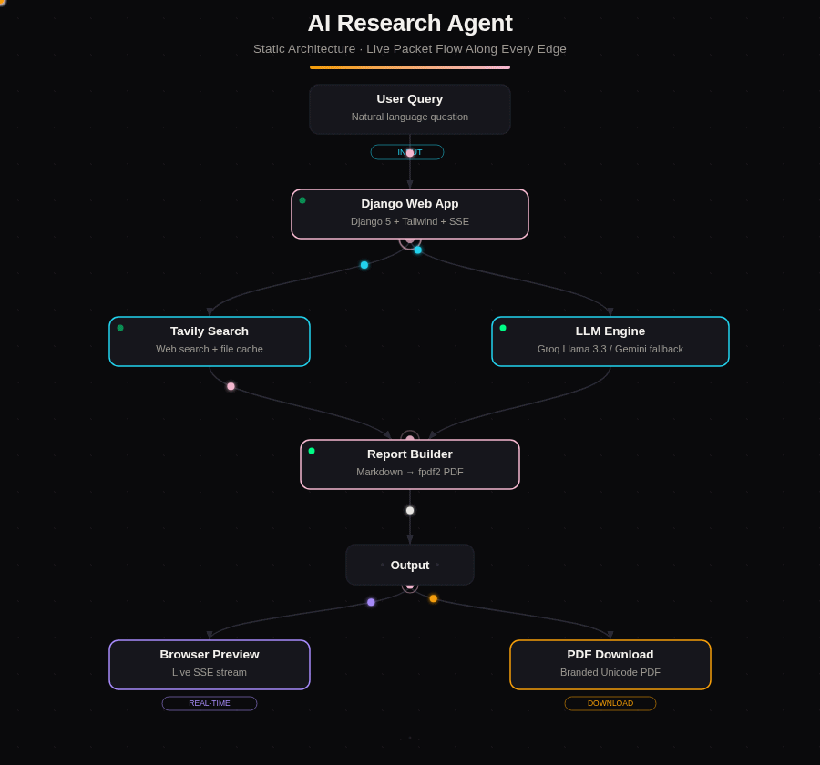
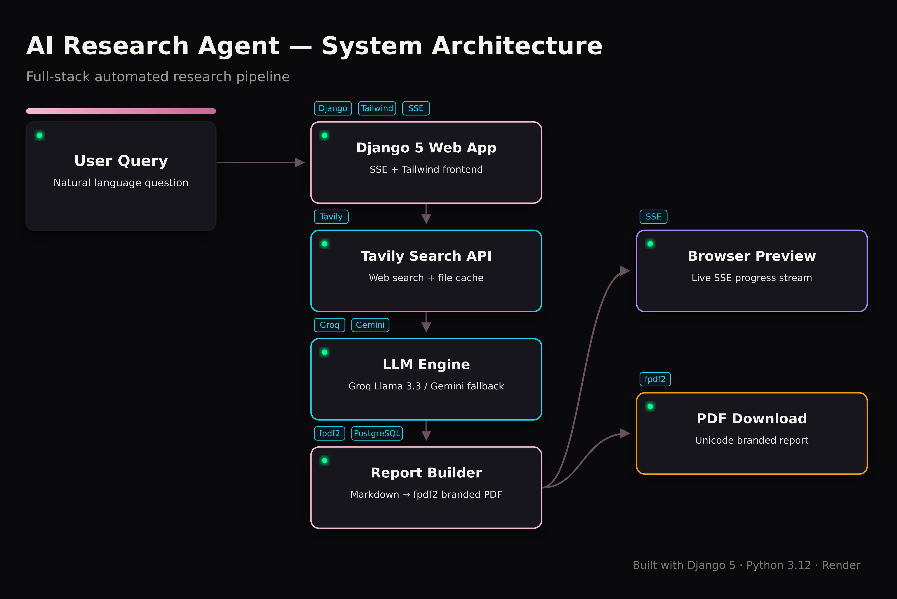

# AI Research Agent

Turn a natural-language question into a structured, cited, downloadable PDF research report — automatically.

Submit a query → the agent searches the web (Tavily), summarises the findings with an LLM (Groq / Llama 3.3, Gemini fallback), builds a Markdown report, and exports a branded PDF — with live progress streamed to the browser.

## Architecture





## Tech Stack

| Layer | Technology |
|---|---|
| Web framework | Django 5 (Python 3.12) |
| Frontend | Django templates, Tailwind, vanilla JS (SSE) |
| Web search | Tavily API (file-cached) |
| LLM | Groq (llama-3.3-70b-versatile); Gemini fallback |
| PDF | fpdf2 (Unicode/DejaVu branded reports) |
| Database | SQLite (dev) / PostgreSQL via `dj-database-url` (prod) |
| Concurrency | In-process `ThreadPoolExecutor` job queue + SSE |
| Deploy | Render (free tier) / Docker / Fly.io |

## Features

- User auth (register / login / password reset), per-user profiles & theming
- Research wizard with real-time SSE progress, cancellation, and **versioned retries**
- Hourly usage quotas (free / premium roles), rate limiting, CSP/security headers
- Markdown report preview, PDF download/stream, regeneration
- Search history with favourites, tags, and bulk actions
- Save-as-template and reusable research templates
- Shareable report links (expiry, view counts)
- Admin dashboard: analytics, user/quota management, API-key rotation, log viewer, queue monitor, cache cleanup

## Quick Start (local)

```bash
git clone <repo> && cd ai_research_agent
python -m venv .venv && .venv\Scripts\activate   # or: source .venv/bin/activate
pip install -r requirements.txt
cp .env.example .env          # then fill in your API keys
python manage.py migrate
python manage.py createsuperuser
python manage.py runserver
```

Open http://127.0.0.1:8000 — health check at `/health/`.

### Required environment variables (see `.env.example`)

```
SECRET_KEY=...
GROQ_API_KEY=...
TAVILY_API_KEY=...
GOOGLE_API_KEY=...      # optional, Gemini fallback
DEBUG=True              # local only
# DATABASE_URL=...      # prod; defaults to SQLite in dev
```

## Tests

```bash
python run_tests.py
# or: python manage.py test apps.accounts apps.research apps.reports apps.utils
```

21 tests across auth, chunking, report building, and validators.

## Deployment (Render free tier)

The repo ships a Render blueprint and build script.

1. **Push** this repo to GitHub.
2. Render dashboard → **New → Blueprint** → select the repo (uses `render.yaml`).
   It provisions a free **web service** and a free **PostgreSQL** instance.
3. Set the env vars in the web service:
   - `SECRET_KEY` (auto-generated), plus `GROQ_API_KEY`, `TAVILY_API_KEY`, `GOOGLE_API_KEY`
   - `DEBUG=False`, `ALLOWED_HOSTS=<your-app>.onrender.com`, `CSRF_TRUSTED_ORIGINS=https://<your-app>.onrender.com`
   - `DATABASE_URL` → link from the Render Postgres instance (`render.yaml` does this automatically)
4. Deploy. `build.sh` runs `pip install` → `migrate` → `collectstatic`.

> **Free-tier notes:** the DB expires after **90 days** (back it up with `scripts/backup.sh` first), and the web service **spins down after ~15 min** idle (first hit cold-starts in ~30 s). PDFs under `media/` do **not** survive redeploys on the ephemeral filesystem.

Docker alternative: `docker build -t research-agent . && docker run -p 8000:8000 --env-file .env research-agent`

## Roadmap status (as of 2026-08-07)

| Phase | Status | Notes |
|---|---|---|
| **0 — Foundation** | ✅ Done | BOM fix, Django 5 STORAGES, URL fixes |
| **1 — Deploy on Render** | ✅ Code-ready | Sprint A+B complete; all blockers fixed. Remaining: push + click Deploy on Render |
| **2 — GitHub/LinkedIn launch** | ✅ Code-complete | README, LICENSE (MIT), `.github/` + CONTRIBUTING + issue templates, LinkedIn post draft at `.github/LINKEDIN_POST_DRAFT.md` |
| **3 — Production hardening** | ✅ Code-complete | Celery (opt-in via `CELERY_BROKER_URL`), R2/S3 (opt-in), Sentry (opt-in via `SENTRY_DSN`), email verification (opt-in). Remaining: provision services on Render account |
| **4 — Feature expansion** | ✅ Code-complete | Templates+share links fixed, quota chip in navbar, **report rating** with feature flag (`FEATURE_REPORT_RATING`), search-depth / LLM toggles behind flags |

### Manual steps only you can do

1. **Rotate API keys** in Groq/Tavily/Google dashboards if `.env` was ever committed.
2. **Deploy to Render** (Dashboard → New → Blueprint → point at this repo).
3. **Publish the LinkedIn post** (edit `.github/LINKEDIN_POST_DRAFT.md`, attach screenshots from `docs/screenshots/`).
4. **Opt-in services** for Phase 3: add Upstash Redis (`CELERY_BROKER_URL`), Cloudflare R2 (`USE_S3_MEDIA=True` + credentials), Sentry (`SENTRY_DSN`), SMTP (`EMAIL_HOST` etc.).
5. **UAT**: 3 test users exercising the full pipeline end-to-end.

## Project docs

| File | Contents |
|---|---|
| `Architecture.md` | Pipeline & component design |
| `PRD.md` | Product requirements, user stories, KPIs |
| `Phases.md` | Delivery phases + roadmap (Phases 0–4) |
| `Rules.md` | Coding & security standards |
| `design.md` | Design tokens, theming, a11y |
| `INSTALL.md` | Day-1 environment fixes |
| `DEPLOY.md` | Render quick deploy |

## Known limitations

- In-process thread queue (no Celery yet) — jobs don't survive restarts
- Local `media/` storage — PDFs are ephemeral on Render
- `dj-database-url` is declared in `requirements.txt`; keep `DATABASE_URL` set in prod
- `.env` is git-ignored — never commit real keys

## License

_To be added in Phase 2 (MIT)._
